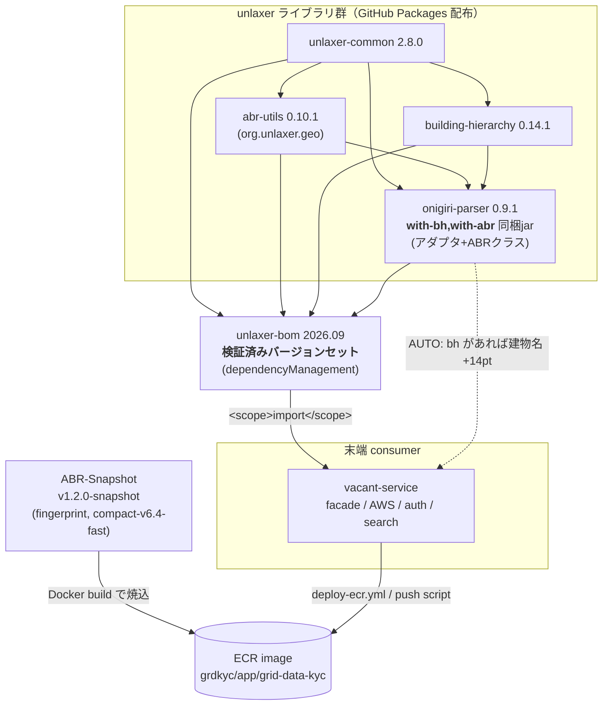
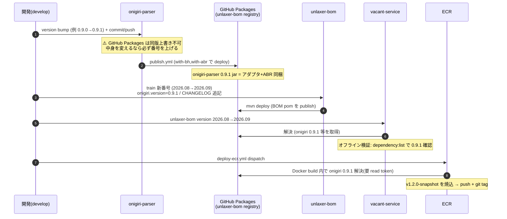
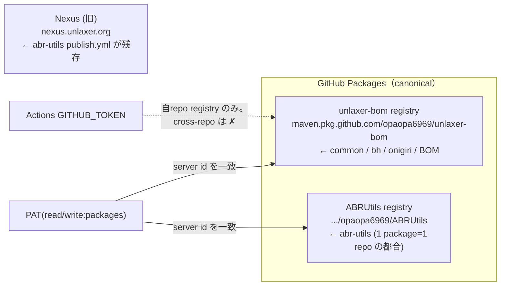
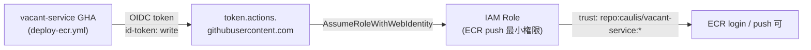
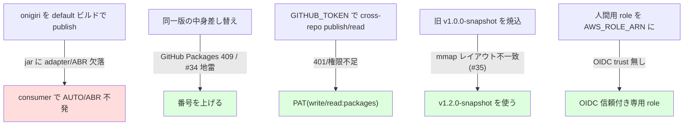

# リリースの仕組み・設定・運用

unlaxer 群（`unlaxer-common` / `abr-utils` / `building-hierarchy` / `onigiri-parser`）と、
それを束ねる **unlaxer-bom（リリーストレイン）**、末端 consumer **vacant-service**、
そして **ECR デプロイ**までの一連の流れをまとめる。

- 配布チャネル: **GitHub Packages**（`maven.pkg.github.com/opaopa6969/...`）に集約（canonical）。
  Nexus（nexus.unlaxer.org）は旧経路で `abr-utils` の publish.yml が残っている（移行途中・後述）。
- 住所スナップショット: **ABR-Snapshot**（GitHub Releases）。現行 `v1.2.0-snapshot`（payload fingerprint 付き）。

---

## 1. 全体像



ポイント:
- **BOM が唯一の「版の真実」**。consumer は個別 version を書かず、BOM の train 番号だけを上げる。
- **onigiri は必ず `with-bh,with-abr` でビルドして publish**（default ビルドだと
  アダプタ `UnlaxerBuildingHierarchyResolver` と ABR クラス `parser/impl/abr/*` が jar から欠落し、
  consumer 側で AUTO/ABR が不発になる）。
- **AUTO 既定**: onigiri は `fromSystemProperties()` / `AddressParserFactory` の既定が AUTO。
  building-hierarchy が classpath にあれば自動で建物名抽出 +14pt、無ければ従来 HEURISTIC（byte-identical）。

---

## 2. リリースの流れ（新しい onigiri を出す例）



### 版番号の規約
- **同一版の中身差し替えは禁止**（#34 の地雷＝「同じ 0.10.0 に修正前/後が混在」）。
  GitHub Packages は release 版を immutable 扱いにするので、`409 Conflict` になる。
  **中身を変えたら必ず番号を上げる**（例: 0.9.0→0.9.1、train 2026.08→2026.09）。
- **train は CalVer `YYYY.MM`**（同月複数回は連番運用 or `.N` を検討）。
- ライブラリ個別は SemVer。「どの組み合わせが検証済みか」は BOM の train が唯一示す。

---

## 3. 配布チャネルと認証



- **GitHub Packages の鉄則**: 1 package = 1 repo/owner に固定。
  abr-utils は ABRUtils repo registry に紐付くため、**consumer は `<repository>` が2つ要る**
  （unlaxer-bom registry ＋ ABRUtils registry）。
- **`GITHUB_TOKEN` は自 repo の registry にしか書けない**。onigiri→unlaxer-bom registry は
  **cross-repo なので write:packages の PAT が必須**（read も building-hierarchy/abr-utils 解決に要る）。
- `~/.m2/settings.xml` / CI の settings.xml は **server `<id>` を pom の repository/distributionManagement id に
  一致**させること（`github-unlaxer-bom` / `github-abrutils`）。

---

## 4. 必要な secrets / variables（一度だけ）

| repo | 種別 | 名前 | 中身・用途 |
|---|---|---|---|
| onigiri-parser | secret | `PACKAGES_PUBLISH_TOKEN` | PAT（**write+read:packages**）。publish.yml が deploy に使用 |
| vacant-service | secret | `PACKAGES_READ_TOKEN` | PAT（**read:packages**）。Docker build が依存解決に使用 |
| vacant-service | variable | `AWS_ROLE_ARN` | GitHub OIDC で assume する IAM role の ARN（後述） |

> ⚠️ PAT は GitHub アカウントの token。**Actions の `GITHUB_TOKEN` は cross-repo package を読めない**ため、
> 上記は必ず PAT を使う。`gh` CLI が使っている PAT（read/write:packages スコープがあれば）をそのまま入れて良い。

### AWS OIDC role（`AWS_ROLE_ARN`）



GHA は **GitHub OIDC** で role を assume する。したがって role の **信頼ポリシー（trust policy）に
GitHub OIDC プロバイダ＋このrepo条件**が入っている必要がある。普段 aws-vault で使っている role は
**人間用（SSO / assume-role）** で GitHub OIDC を信頼していないのが普通 → そのままでは assume できない。

> **例外**: その role の trust policy に既に `token.actions.githubusercontent.com` ＋
> `repo:caulis/vacant-service:*` が入っているなら、その ARN をそのまま `AWS_ROLE_ARN` に使ってよい。
> 入っていなければ下記が必要。**普段の role の trust policy を見れば OIDC 対応済みかすぐ分かる。**

#### 要るもの（AWS account `448049809927` / region `ap-northeast-1`）

1. **GitHub OIDC プロバイダ**が存在すること
   （`arn:aws:iam::448049809927:oidc-provider/token.actions.githubusercontent.com`）。無ければ作る。
2. **専用 role を作成**（or 既存 role の trust に追記）。一番きれいなのは「ECR push 専用の最小権限 role」を1個作る。

**trust policy**（この repo の GHA だけが assume 可）:
```json
{ "Version": "2012-10-17", "Statement": [{
  "Effect": "Allow",
  "Principal": { "Federated": "arn:aws:iam::448049809927:oidc-provider/token.actions.githubusercontent.com" },
  "Action": "sts:AssumeRoleWithWebIdentity",
  "Condition": {
    "StringEquals": { "token.actions.githubusercontent.com:aud": "sts.amazonaws.com" },
    "StringLike":   { "token.actions.githubusercontent.com:sub": "repo:caulis/vacant-service:*" }
  }
}]}
```

**権限ポリシー**（ECR push に必要なだけ）:
```json
{ "Version": "2012-10-17", "Statement": [
  { "Effect": "Allow", "Action": "ecr:GetAuthorizationToken", "Resource": "*" },
  { "Effect": "Allow",
    "Action": [
      "ecr:BatchCheckLayerAvailability", "ecr:InitiateLayerUpload", "ecr:UploadLayerPart",
      "ecr:CompleteLayerUpload", "ecr:PutImage", "ecr:BatchGetImage", "ecr:ListImages"
    ],
    "Resource": [
      "arn:aws:ecr:ap-northeast-1:448049809927:repository/grdkyc/app/grid-data-kyc",
      "arn:aws:ecr:ap-northeast-1:448049809927:repository/grdkyc/app/grid-data-kyc-debug"
    ] }
]}
```
> `deploy-ecr.yml` の「Compute date-revision tag」ステップが `aws ecr list-images` を使うため
> `ecr:ListImages` も含めてある。`grid-data-kyc-debug` は debug イメージ用（GHA は通常イメージのみ push、
> ローカル script は両方 push するので両 repo を許可しておくと両対応）。

3. その role の **ARN を vacant-service の repo variable `AWS_ROLE_ARN`** に設定。

#### まとめ
- **普段の role は基本流用不可**（trust に GitHub OIDC 条件が要る）。trust に上記条件を追記すれば流用も可。
- 一番きれいなのは **ECR push 専用の最小権限 role を1個作る**（上の policy そのまま）。
- repo variable `AWS_ROLE_ARN` ＋ secret `PACKAGES_READ_TOKEN`(PAT) を入れれば、あとは
  `deploy-ecr.yml` を dispatch するだけ。

---

## 5. 運用手順（チートシート）

### A. unlaxer ライブラリを新版で出す（例: onigiri）
```text
1. onigiri-parser: pom version を上げて commit/push
2. publish.yml を workflow_dispatch（with-bh,with-abr で deploy。要 PACKAGES_PUBLISH_TOKEN）
   ※ release publish イベントでも自動起動
3. registry に <新版> が入ったか確認:
   gh api /users/opaopa6969/packages/maven/org.unlaxer.onigiri-parser/versions --jq '.[].name'
   jar に abr+bh が入っているか:
   unzip -l onigiri-parser-<ver>.jar | grep -E 'impl/abr/Abr|UnlaxerBuildingHierarchyResolver'
```

### B. 新しい BOM train を切る
```text
1. unlaxer-bom: pom.xml の <version> を新 train に、変えた artifact の *.version プロパティを更新
2. CHANGELOG.md に train を追記（最新を上に。変更点＋検証エビデンス）
3. mvn deploy（distributionManagement=unlaxer-bom registry。要 write PAT）
```

### C. consumer（vacant-service）を最新に追従
```text
1. service/pom.xml の unlaxer-bom <version> を新 train に上げるだけ（個別版は書かない）
2. オフライン検証: mvn -o -DskipTests compile / dependency:list で版を確認
3. commit/push
```

### D. ECR へデプロイ（GHA）
```text
1. vacant-service に secret PACKAGES_READ_TOKEN（PAT）+ variable AWS_ROLE_ARN を設定
2. Actions「Build and Push to ECR」(deploy-ecr.yml) を workflow_dispatch
   - abr_snapshot_tag は既定 v1.2.0-snapshot（fingerprint 版）
   - Docker build が onigiri 等を GitHub Packages から解決 → snapshot 焼込 → ECR push + git tag
```

---

## 6. 落とし穴（重要）



- onigiri publish は **必ず `with-bh,with-abr`**（publish.yml はそうなっている）。
- **版の中身を変えたら番号を上げる**（immutable 前提）。
- **publish/read は PAT**（cross-repo は GITHUB_TOKEN 不可）。
- ECR の **snapshot は v1.2.0-snapshot**（旧 v1.0.0 は #35 の mmap クラッシュ）。
- **AWS_ROLE_ARN は OIDC 信頼付き role**（普段の人間用 role は基本流用不可）。

---

## 7. 関連
- BOM 履歴・各 train の検証エビデンス: [CHANGELOG.md](../CHANGELOG.md)
- 設計判断: onigiri-parser#78（BOM 採用）, #77（building-hierarchy 統合 / AUTO）, ABRUtils#34/#35（snapshot 互換）
- snapshot 配布: https://github.com/opaopa6969/ABR-Snapshot/releases
